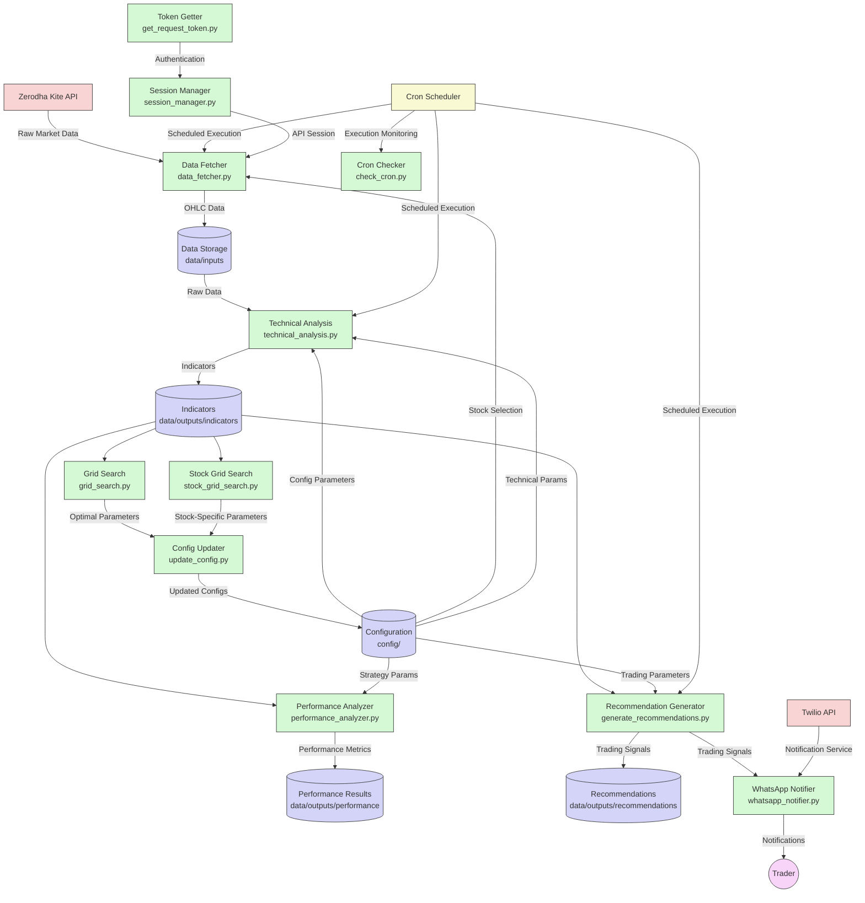

# Algorithmic Trading System

A Python-based algorithmic trading system that fetches market data from Zerodha's Kite Connect API, performs technical analysis, optimizes parameters, back-tests trading strategies, and sends WhatsApp notifications for trading signals.

## Project Structure

```
algo_trading/
├── config/
│   ├── trading_config.yaml        # Stock selection configuration
│   ├── technical_indicators.yaml  # Default technical analysis parameters
│   └── stock_configs/             # Stock-specific indicator parameters
├── data/
│   ├── inputs/                    # Raw OHLC data
│   └── outputs/                   # Processed data with indicators
│       ├── indicators/            # Technical indicator outputs
│       ├── performance/           # Performance analysis results
│       ├── grid_search/           # Global grid search results
│       ├── stock_grid_search/     # Stock-specific grid search results
│       └── recommendations/       # Daily stock recommendations
├── logs/                         # Application logs
├── scripts/
│   ├── data_fetcher.py           # Fetches OHLC data from Kite Connect
│   ├── technical_analysis.py      # Technical analysis calculations
│   ├── performance_analyzer.py    # Back-testing and performance metrics
│   ├── grid_search.py            # Global parameter optimization
│   ├── stock_grid_search.py      # Stock-specific parameter optimization
│   ├── update_config.py          # Auto-updates config with best params
│   ├── generate_recommendations.py # Generates trading recommendations
│   ├── whatsapp_notifier.py      # Sends WhatsApp notifications
│   ├── setup_crontab.sh          # Crontab setup automation script
│   ├── check_cron.py             # Monitors cron job execution
│   ├── get_request_token.py       # Kite Connect authentication
│   └── session_manager.py        # Manages API session
├── .env                          # API credentials (not tracked in git)
├── .env.sample                   # Sample environment variables
├── crontab_config_template.txt   # Template for crontab configuration
├── requirements.txt              # Python dependencies
├── CRONTAB_SETUP.md              # Crontab setup instructions
├── WHATSAPP_NOTIFICATIONS.md     # WhatsApp notification setup guide
└── README.md                     # This file
```

## Features

1. **Data Fetching**
   - Automated OHLC data fetching from Kite Connect API
   - Configurable stock selection (specific symbols or all equity stocks)
   - Incremental updates to avoid redundant downloads
   - Automated scheduling via cron jobs

2. **Technical Analysis**
   - MACD (Moving Average Convergence Divergence)
   - Support and Resistance levels
   - Average True Range (ATR)
   - Exponential Moving Average (EMA)
   - Bollinger Bands
   - RSI (Relative Strength Index)
   - Combined signal generation
   - Stop-loss and take-profit calculation
   - Stock-specific configuration support
   - Automated fallback to default configurations

3. **Performance Analysis**
   - Back-testing of trading strategies
   - Comprehensive performance metrics:
     - CAGR (Compound Annual Growth Rate)
     - Sharpe Ratio
     - Win Rate
     - Maximum Drawdown
     - Capital Utilization
     - Trade Duration Analysis
   - Trade logging and reporting
   - Yearly performance summaries
   - Stock-specific performance analysis
   - Portfolio-level analysis

4. **Parameter Optimization**
   - Global grid search for all stocks
   - Stock-specific parameter optimization 
   - Configurable metrics for optimization (Sharpe, CAGR, Win Rate)
   - Automatic configuration updates with best parameters
   - Memory-efficient processing of large parameter spaces

5. **Trading Recommendations**
   - Daily stock recommendations based on technical analysis
   - Investment amount calculation based on configured maximum investment
   - Stop-loss and take-profit levels for risk management
   - WhatsApp notifications for trading signals
   - End-of-day trading summary reports

## Architecture Diagram

The following diagram illustrates the system architecture and data flow of the algorithmic trading system:



The architecture consists of several key components:

1. **Data Pipeline**
   - Data Fetcher retrieves OHLC data from Kite Connect API
   - Technical Analysis processes raw data to generate indicators
   - Data flows through storage locations in the `data/` directory

2. **Optimization Subsystem**
   - Grid Search performs global parameter optimization
   - Stock Grid Search optimizes parameters for individual stocks
   - Config Updater applies optimal parameters to configuration files

3. **Analysis & Recommendation Engine**
   - Performance Analyzer evaluates trading strategies
   - Recommendation Generator produces trading signals
   - WhatsApp Notifier delivers signals to the trader

4. **Automation Framework**
   - Cron Scheduler automates execution of scripts
   - Cron Checker monitors job execution
   - Session Manager handles API authentication

5. **Configuration Management**
   - Centralized configuration in YAML files
   - Default and stock-specific parameter sets
   - Authentication credentials in environment variables

The system uses a modular design where each component performs a specific function and communicates through standardized data files, enabling flexibility and maintainability.

### Trading Recommendations

1. **Generate Recommendations**
   ```bash
   python scripts/generate_recommendations.py --config config/trading_config.yaml --notifications
   ```
   This will:
   - Analyze all stocks in the trading configuration
   - Generate buy/sell/hold signals
   - Send WhatsApp notifications for buy signals
   - Create a recommendations file in `data/outputs/recommendations/`

2. **View Recommendations**
   ```bash
   # List the latest recommendations
   ls -l data/outputs/recommendations/
   
   # View the latest file
   cat data/outputs/recommendations/stock_recommendations_YYYYMMDD.csv
   ```

## Standardized Output Directory Structure

All outputs are organized into standardized directories for easier management:

1. **Technical Analysis**: `data/outputs/indicators/`
   - Combined indicators: `all_indicators_YYYYMMDD.csv`
   - Individual stock indicators: `{SYMBOL}_indicators.csv`

2. **Performance Analysis**: `data/outputs/performance/`
   - Overall metrics: `overall_metrics.yaml`
   - Yearly summary: `yearly_summary.csv`
   - Trade log: `trade_log.csv`

3. **Grid Search**: `data/outputs/grid_search/`
   - Grid search results: `grid_search_results.csv`
   - Top configurations: `top_configurations.yaml`

4. **Stock Grid Search**: `data/outputs/stock_grid_search/{SYMBOL}/`
   - Stock-specific results: `grid_search_results.csv`
   - Stock-specific configurations: `top_configurations.yaml`
   - Best config: `best_config.yaml`
   
5. **Recommendations**: `data/outputs/recommendations/`
   - Daily recommendations: `stock_recommendations_YYYYMMDD.csv`
   - Latest recommendations: `latest_recommendations.csv`

6. **Logs**: `logs/`
   - Script-specific logs: `{script_name}.log`
   - Grid search logs: `grid_search.log`
   - Stock-specific grid search logs: `stock_grid_search/{SYMBOL}/grid_search.log`
   
All scripts use these hardcoded paths - you no longer need to specify output directories or log paths.

## Setup

1. **Environment Setup**
   ```bash
   # Create virtual environment
   python -m venv .venv
   source .venv/bin/activate  # On Windows: .venv\Scripts\activate
   
   # Install dependencies
   pip install -r requirements.txt
   ```

2. **API Configuration**
   Create a `.env` file with your API credentials (copy from `.env.sample`):
   ```
   # Zerodha credentials
   API_KEY=your_zerodha_api_key
   API_SECRET=your_zerodha_api_secret
   
   # Twilio credentials (for WhatsApp notifications)
   TWILIO_ACCOUNT_SID=your_twilio_account_sid
   TWILIO_AUTH_TOKEN=your_twilio_auth_token
   TWILIO_FROM_NUMBER=your_twilio_whatsapp_number
   TWILIO_TO_NUMBER=your_personal_whatsapp_number
   ```

3. **Authentication**
   ```bash
   python scripts/get_request_token.py
   ```
   Follow the browser prompt to log in to your Zerodha account.

4. **Crontab Setup**
   ```bash
   # Automated setup
   ./scripts/setup_crontab.sh
   
   # Or manual setup
   cp crontab_config_template.txt crontab_config.txt
   # Edit crontab_config.txt to replace {{PROJECT_PATH}} with your actual path
   crontab crontab_config.txt
   ```
   See `CRONTAB_SETUP.md` for more details on configuring automated trading schedules.

## Documentation

Additional documentation is available in the following files:

1. **Crontab Setup**: `CRONTAB_SETUP.md`
2. **WhatsApp Notifications**: `WHATSAPP_NOTIFICATIONS.md`
3. **Logs Management**: `logs/README.md`

## Usage

### Data Fetching

```bash
# Fetch data for all stocks in the configuration
python scripts/data_fetcher.py

# Fetch data for all stocks with a specific config file
python scripts/data_fetcher.py --config config/trading_config.yaml
```

### Technical Analysis

```bash
# Run technical analysis on a single stock file
python scripts/technical_analysis.py --input data/inputs/ADANIENT_day.csv

# Run technical analysis on all stocks using stock-specific configs where available
python scripts/technical_analysis.py --all

# Run technical analysis with a specific configuration file
python scripts/technical_analysis.py --input data/inputs/ADANIENT_day.csv --config config/technical_indicators.yaml
```

### Performance Analysis

```bash
# Run performance analysis with default settings
python scripts/performance_analyzer.py --input data/outputs/all_indicators_YYYYMMDD.csv

# Run performance analysis with specific capital and investment amounts
python scripts/performance_analyzer.py --input data/outputs/all_indicators_YYYYMMDD.csv --initial-capital 1000000 --max-investment 5000

# Run with percentage-based position sizing (15% of available capital per trade)
python scripts/performance_analyzer.py --input data/outputs/all_indicators_YYYYMMDD.csv --position-size-pct 15

# Run with aggressive position sizing (30% of available capital per trade)
python scripts/performance_analyzer.py --input data/outputs/all_indicators_YYYYMMDD.csv --position-size-pct 30 --max-investment 1000000

# Run with conservative position sizing (5% of available capital per trade)
python scripts/performance_analyzer.py --input data/outputs/all_indicators_YYYYMMDD.csv --position-size-pct 5

# Run performance analysis using stock-specific configurations
python scripts/performance_analyzer.py --input data/outputs/all_indicators_YYYYMMDD.csv --use-stock-configs

# Optimize for a specific metric
python scripts/performance_analyzer.py --input data/outputs/all_indicators_YYYYMMDD.csv --metric sharpe_ratio
```

### Global Grid Search

```bash
# Run grid search with a consolidated indicators file
python scripts/grid_search.py --input data/outputs/all_indicators_YYYYMMDD.csv

# Run grid search using individual stock OHLCV files
python scripts/grid_search.py --input-dir data/inputs

# Run grid search for specific stocks only
python scripts/grid_search.py --input-dir data/inputs --stocks ADANIENT RELIANCE HDFC

# Use stock list from trading config
python scripts/grid_search.py --input-dir data/inputs --trading-config config/trading_config.yaml

# Run grid search with specific capital settings
python scripts/grid_search.py --input-dir data/inputs --initial-capital 1000000 --max-investment 5000

# Limit the search to a subset of combinations
python scripts/grid_search.py --input-dir data/inputs --max-combinations 1000
```

### Stock-Specific Grid Search

```bash
# Run grid search for specific stocks
python scripts/stock_grid_search.py --input data/outputs/all_indicators_YYYYMMDD.csv --stocks ADANIENT RELIANCE HDFC

# Use stock configuration from a trading config file
python scripts/stock_grid_search.py --input data/outputs/all_indicators_YYYYMMDD.csv --trading-config config/trading_config.yaml
```

### Update Configuration with Optimal Parameters

```bash
# Update the global configuration file with the best parameters from grid search
python scripts/update_config.py --results data/outputs/grid_search/top_configurations.yaml --config config/technical_indicators.yaml

# Choose a specific metric for optimization
python scripts/update_config.py --results data/outputs/grid_search/top_configurations.yaml --config config/technical_indicators.yaml --metric win_rate
```